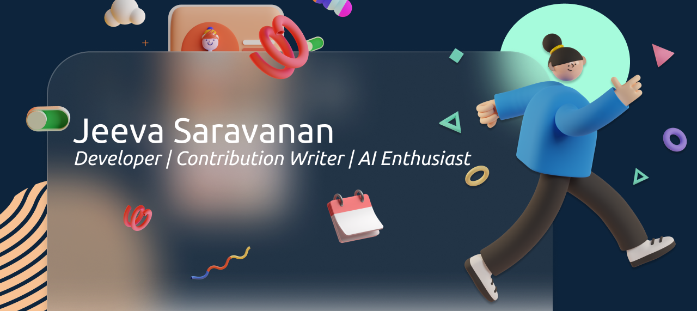

 

<h3> Hi 👋</h3>

<i>I'm Jeeva, a Passionate Software Engineer. I'm in pursuit of expanding my knowledge and open to exploring opportunities along my way. I prefer to keep learning, continue to challenge myself, and do interesting things that matter.</i>

<h3>At Present 📌</h3>

* Software Developer 👩🏻‍💻 in Zoho Corp. 
* Contributing Writer 📚 in Analytics Vidhya & The Lean Programmer.

<h3>What I'm focusing on 👇🏻</h3>

* Learning: Machine Learning, AI 🤖 ...
  <i>Would love to collobrate and receive suggestion.</i>

<h3>In my spare time 👀</h3>

You can find me with books sometimes. I love to read coming of age fiction not big fan of romance though. In my spare time I watch sitcoms and do some sketches.

<b>Favourite Book:</b> <i> The Kite Runner by Khaled Hosseini.</i> 

<h3> My Stats 📊</h3>

 

 

<!---
JeevaSaravanan/JeevaSaravanan is a ✨ special ✨ repository because its `README.md` (this file) appears on your GitHub profile.
You can click the Preview link to take a look at your changes.
--->
